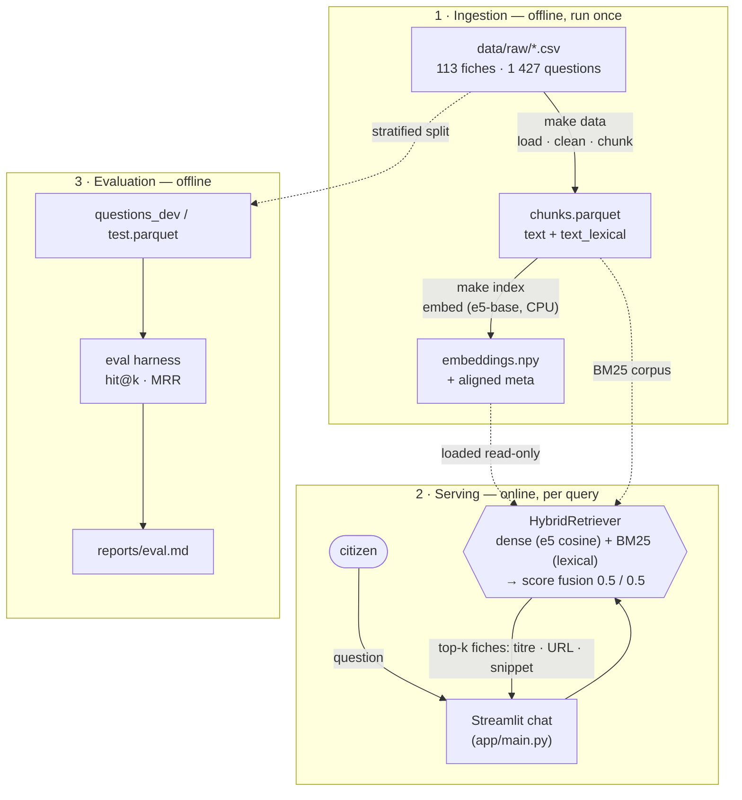

# DGFiP Chatbot

A retrieval-first FAQ assistant for the **DGFiP "espace particulier"**: given a citizen's
question, it routes to the **most relevant *fiche pratique*** (from impots.gouv) and cites
the official source. Built as a POC for a technical test.

- **Datasets:** [`data/README.md`](data/README.md)

## Architecture

Two offline build steps produce a chunk **index**; the Streamlit app loads that index and
answers each question by routing it to the most relevant fiche — locally, no external calls.



**Flow.** `make data` cleans and chunks the 113 fiches into `chunks.parquet` — a natural-text
column for embeddings plus a normalized `text_lexical` column for BM25 — and splits the
questions dev/test. `make index` embeds each chunk **once** with a local e5-base model. At query
time the app loads the cached index read-only and the **HybridRetriever** scores the question
two ways (dense cosine + BM25), fuses them (confidence-aware, 0.5/0.5), and returns the top
fiches with their official URLs. The only model is the small embedder — no LLM, no API.

## Quickstart

Requires [`uv`](https://docs.astral.sh/uv/) (it manages Python 3.12 for you). Install it first if needed:

```bash
# install uv (macOS/Linux), then restart your shell so it's on PATH:
curl -LsSf https://astral.sh/uv/install.sh | sh
#   alternatives: pipx install uv · brew install uv · pip install uv
#   Windows (PowerShell): irm https://astral.sh/uv/install.ps1 | iex
```

```bash
git clone <repo> && cd dgfip-chatbot
make setup                          # uv sync — create .venv from the lockfile (base + dev)
make data                           # build the chunk table + dev/test split
uv sync --group ml && make index    # embed + cache the chunk index (needed by retrieval & app)
make app                            # launch the Streamlit retrieval chat
```

> **Why uv?** A single tool replacing pip + venv + pyenv + pip-tools. The committed
> `uv.lock` pins every direct **and transitive** dependency (with hashes, cross-platform),
> so `uv sync` reproduces the *exact* environment — `git clone && uv sync` just works.

## Commands

| Command | Does |
|---|---|
| `make setup` | Sync the base + dev environment |
| `make data` | Build processed chunks + dev/test split |
| `make index` | Embed + cache the chunk index *(needs `uv sync --group ml`)* |
| `make app` | Launch the Streamlit retrieval-chat demo *(needs `--group ml --group app`)* |
| `make eval` | Final eval of the chosen config on the held-out test set |
| `make experiments` | Dev-set chunking ablations |
| `make fusion-stemming` | Dev-set fusion-weight × stemming sweep |
| `make lint` / `make format` | Lint / format with ruff |
| `make test` | Run the test suite |

Dependencies are grouped: `uv sync --group ml` (embeddings / retrieval / eval) and
`--group app` (the Streamlit demo). `make app` pulls both in automatically.

## Project structure

```
src/dgfip_chatbot/
  config.py        # paths, model names, params (pydantic-settings)
  data/            # load / clean / chunk the fiches + eval questions
  retrieval/       # embeddings, index, dense / BM25 / hybrid retrievers
  eval/            # metrics + evaluation harness
  app/             # Streamlit chat demo (UI + serving; no separate backend)
data/raw/          # provided CSVs (KB + eval questions) — see data/README.md
data/processed/    # `make data` / `make index` output (gitignored)
tests/
reports/           # eval.md — the evaluation writeup
```

## Data exploration

A first look (see [`notebooks/eda.ipynb`](notebooks/eda.ipynb)):

- **Themes:** 5 categories; **property & housing is the largest (~44% of questions)**, not income declaration.
- **Length:** fiches vary widely (median ~4.9k chars) → motivates chunking.
- **Skew:** questions per fiche range from 6 to 55.
- **Vocabulary overlap (key signal):** most questions share many content words with their target fiche (favourable to **BM25**), but a meaningful tail does not (needs **semantic embeddings**) → together motivating a **hybrid** retriever.
- **Caveat:** the questions are LLM-generated from the fiches, so this overlap is likely **optimistic** versus real user phrasing.

## Results

Methods evaluated on **dev** (test held out): **dense** (e5-base), **BM25**, **hybrid — RRF**,
**hybrid — score fusion**. Levers tried and **rejected** (no dev gain): stemming, semantic
chunking, title-prepend, cross-encoder rerank, e5-large, chunk-size 128.

**Best: hybrid with confidence-aware score fusion (dense 0.5 / BM25 0.5)** — the only lever that
beat the RRF baseline on dev. Scored **once** on the held-out test:

| score fusion (0.5 / 0.5) | hit@1 | hit@3 | MRR |
|:--|--:|--:|--:|
| dev (1 004 q) | 0.824 | 0.961 | 0.896 |
| **test (423 q)** | **0.851** | **0.972** | **0.911** |

Full tables: [`reports/eval.md`](reports/eval.md)

## Deployment

The POC runs locally (Streamlit + a local embedding model + an on-disk index). A production
path, roughly in order:

- **Package** — containerize using `uv.lock` for a reproducible image; serve the retriever
  behind a thin API (e.g. FastAPI) or keep Streamlit for an internal tool.
- **Index** — build the embedding index offline and load it read-only at startup. The NumPy
  brute-force search is exact and instant at this scale (113 fiches / ~600 chunks); swap in a
  vector store (FAISS / pgvector) only if the corpus grows by orders of magnitude.
- **Serving** — the embedding model is small and CPU-only (≈ no inference cost); cache query
  embeddings and scale horizontally (the service is stateless) behind a load balancer.
- **Data refresh** — when fiches change, re-ingest → re-chunk → re-embed → hot-swap the index
  on a schedule.
- **Monitoring** — log each query + the chosen fiche to measure real hit-rate, route
  low-confidence queries (no strong match) to a fallback, and feed misses back into evaluation.

An optional generated-answer layer (writing a grounded reply that cites the fiche) is left as a
discussion point rather than built — the brief asks to *return the fiche*, and adding generation
brings cost, latency, and hallucination risk. The code is structured so it could slot in behind
the retrieval step.
